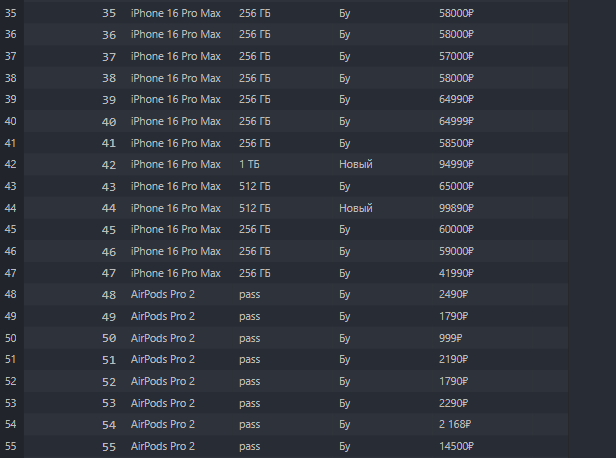

# avito-parser
Python parser for Avito marketplace. Collects iPhone, Airpods and MacBook listings with prices, conditions and memory specs. Data stored in SQLite database.

## Технологии
- Python
- SQLite3
- requests
- BeautifulSoup

## Установка и запуск
1. Клонируй репозиторий
2. Установи зависимости `pip install -r requirements.txt`
3. Запуск `python avito_parser.py`
